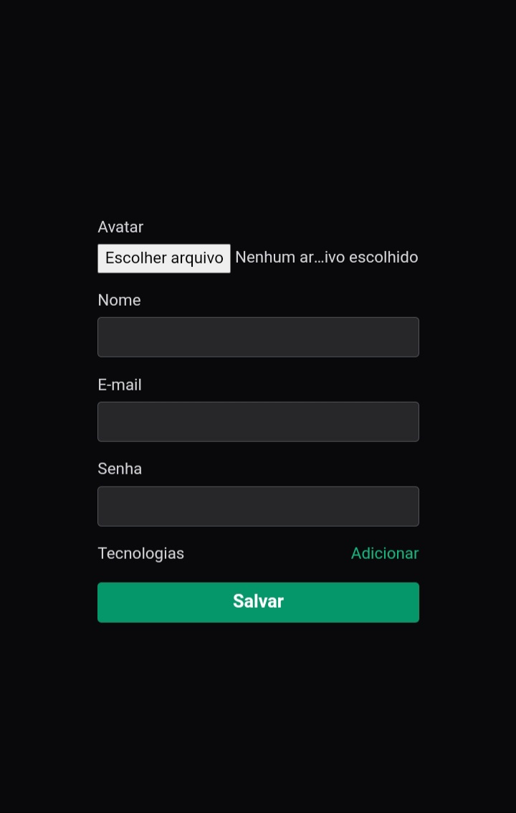

<h1 align="center">Formulário avançado</h1>

Form - React

 

  

## 🚀 Tecnologias

Esse projeto foi desenvolvido com as seguintes tecnologias:

- Typescript 
- React 
- Git e Github
- Vite

## 💻 Projeto

Basicamente a lógica de um formulário comum, só que ela traz várias validações de Campos, como verificação de campos como e-mail, senha, seus campos são obrigatórios.
No entato é um formulário avançado.
